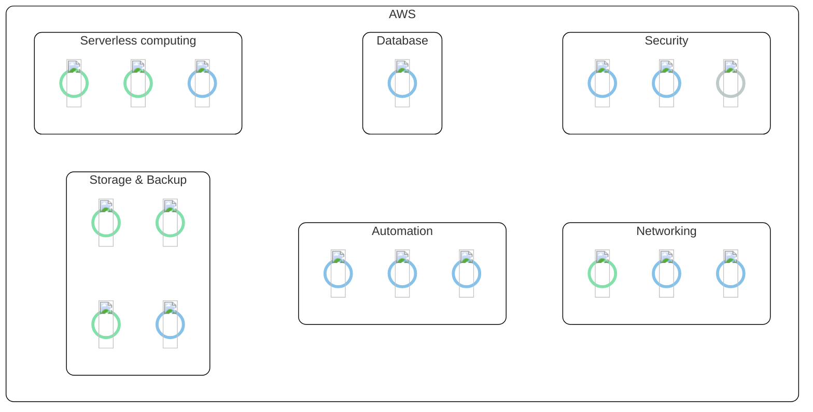

# Skill set

[//]: # (https://aws-icons.com/icons)
[//]: # (https://www.svgrepo.com/vectors)
[//]: # (https://techicons.dev/)

```mermaid
flowchart LR
    classDef junior fill:#0000,stroke:#bfc9caff,stroke-width:4px
    classDef inter fill:#0000,stroke:#85c1e9ff,stroke-width:4px
    classDef senior fill:#0000,stroke:#82e0aaff,stroke-width:4px


    style cicd fill:#0000,stroke:#000,rx:10,ry:10
    subgraph cicd[CI/CD]
        style gitops fill:#0000,stroke:#000,rx:10,ry:10
        subgraph gitops[GitOps]
            argocd((<a href='#argocd'><img src='../../_assets/images/argocd-logo.svg' height='64'/></a>)):::inter
        end
        
        gitlab_ci((<a href='#gitlab-runner'><img src='../../_assets/images/gitlab-logo.svg' height='64'/></a>)):::senior
        github_actions((<a href='#github-actions'><img src='../../_assets/images/github-logo.svg' height='64'/></a>)):::inter
        azure_pipeline((<a href='#azure-pipeline'><img src='../../_assets/images/azure-devops-logo.svg' height='64'/></a>)):::senior
        jenkins((<a href='#jenkins'><img src='../../_assets/images/jenkins-logo.svg' height='100'/></a>)):::junior
        
        gitlab_ci ~~~ github_actions ~~~ gitops
        azure_pipeline ~~~ jenkins ~~~ gitops
    end

%%    style office fill:#0000,stroke:#000,rx:10,ry:10
%%    subgraph office[Office softwares]
%%        microsoft_office((<a href='#microsoft-office'><img src='../../_assets/images/microsoft-office-logo.svg' height='64'/></a>)):::senior
%%        google((<a href='#google'><img src='../../_assets/images/google-logo.svg' height='64'/></a>)):::senior
%%        openoffice((<a href='#openoffice'><img src='../../_assets/images/openoffice-logo.svg' height='64'/></a>)):::senior
%%    end

    style containerization fill:#0000,stroke:#000,rx:10,ry:10
    subgraph containerization[Containerization]
        docker((<a href='#docker'><img src='../../_assets/images/docker-logo.svg' height='64'/></a>)):::senior
        aws_ecs((<a href='#aws-ecs'><img src='../../_assets/images/aws-ecs-logo.svg' height='64'/></a>)):::senior
        aws_ecr((<a href='#aws-ecr'><img src='../../_assets/images/aws-ecr-logo.svg' height='64'/></a>)):::senior
        harbor((<a href='#harbor'><img src='../../_assets/images/harbor-logo.svg' height='64'/></a>)):::junior
        
        style kubernetes_ecosystem fill:#0000,stroke:#000,rx:10,ry:10
        subgraph kubernetes_ecosystem[Kubernetes Ecosystem]
            kubernetes((<a href='#kubernetes'><img src='../../_assets/images/kubernetes-logo.svg' height='64'/></a>)):::senior
            rancher((<a href='#rancher'><img src='../../_assets/images/rancher-logo.svg' height='64'/></a>)):::inter
            helm((<a href='#helm'><img src='../../_assets/images/helm-logo.svg' height='64'/></a>)):::senior
            istio((<a href='#istio'><img src='../../_assets/images/istio-logo.svg' height='80'/></a>)):::junior
            keda((<a href='#keda'><img src='../../_assets/images/keda-logo.svg' height='64'/></a>)):::inter
            aws_eks((<a href='#aws-eks'><img src='../../_assets/images/aws-eks-logo.svg' height='64'/></a>)):::senior
            crossplane((<a href='#crossplane'><img src='../../_assets/images/crossplane-logo.svg' height='64'/></a>)):::junior
            open-policy-agent((<a href='#open-policy-agent'><img src='../../_assets/images/open-policy-agent-logo.svg' height='52'/></a>)):::junior
            prometheus((<a href='#prometheus'><img src='../../_assets/images/prometheus-logo.svg' height='64'/></a>)):::junior
            cloudnativepg((<a href='#cloudnativepg'><img src='../../_assets/images/cloudnativepg-logo.svg' height='64'/></a>)):::junior
            mariadb_operator((<a href='#mariadb-operator'><img src='../../_assets/images/mariadb-logo.svg' height='64'/></a>)):::junior

            kubernetes ~~~ aws_eks  ~~~ rancher
            helm ~~~ istio ~~~ open-policy-agent
            keda ~~~ prometheus ~~~ crossplane
            cloudnativepg ~~~ mariadb_operator
        end

        docker ~~~ aws_ecs ~~~ kubernetes_ecosystem
        harbor ~~~ aws_ecr ~~~ kubernetes_ecosystem
    end

    style observability fill:#0000,stroke:#000,rx:10,ry:10
    subgraph observability[Observability]
        grafana((<a href='#grafana'><img src='../../_assets/images/grafana-logo.svg' height='64'/></a>)):::inter
        datadog((<a href='#datadog'><img src='../../_assets/images/datadog-logo.svg' height='64'/></a>)):::inter
        zabbix((<a href='#zabbix'><img src='../../_assets/images/zabbix-logo.svg' width='64' height='64'/></a>)):::inter
        open_telemetry((<a href='#open-telemetry'><img src='../../_assets/images/open-telemetry-logo.svg' height='64'/></a>)):::junior
        aws_cloud_watch((<a href='#aws-cloud-watch'><img src='../../_assets/images/aws-cloud-watch-logo.svg' height='64'/></a>)):::inter
        elasticsearch((<a href='#elasticsearch'><img src='../../_assets/images/elasticsearch-logo.svg' height='64'/></a>)):::inter

        datadog ~~~ grafana
        open_telemetry ~~~ zabbix
        aws_cloud_watch ~~~ elasticsearch
    end
    
    style os fill:#0000,stroke:#000,rx:10,ry:10
    subgraph os[System]
        linux((<a href='#linux'><img src='../../_assets/images/linux-logo.svg' height='64'/></a>)):::senior
        windows((<a href='#windows'><img src='../../_assets/images/windows-logo.svg' height='64'/></a>)):::junior
        macos((<a href='#macos'><img src='../../_assets/images/macos-logo.svg' height='64'/></a>)):::inter
    end

    style users_management fill:#0000,stroke:#000,rx:10,ry:10
    subgraph users_management[Users & permissions management]
        aws_iam((<a href='#aws-iam'><img src='../../_assets/images/aws-iam-logo.svg' height='64'/></a>)):::inter
        azure_entra((<a href='#azure-entra'><img src='../../_assets/images/azure-entra-logo.svg' height='64'/></a>)):::inter
    end

    style programming fill:#0000,stroke:#000,rx:10,ry:10
    subgraph programming[Programming & scripting]

        style ides fill:#0000,stroke:#000,rx:10,ry:10
        subgraph ides[IDEs]
            intellij-idea((<a href='#intellij-idea'><img src='../../_assets/images/intellij-idea-logo.svg' height='64'/></a>)):::senior
            vscode((<a href='#vscode'><img src='../../_assets/images/vscode-logo.svg' height='64'/></a>)):::inter
            
            intellij-idea ~~~ vscode
        end

        python((<a href='#python'><img src='../../_assets/images/python-logo.svg' height='72'/></a>)):::senior
        rust((<a href='#rust'><img src='../../_assets/images/rust-logo.svg' height='72'/></a>)):::junior
        go((<a href='#go'><img src='../../_assets/images/golang-logo.svg' height='72'/></a>)):::junior
        bash((<a href='#bash'><img src='../../_assets/images/bash-logo.svg' height='72'/></a>)):::senior
        ruby((<a href='#ruby'><img src='../../_assets/images/ruby-logo.svg' height='72'/></a>)):::inter
        java((<a href='#java'><img src='../../_assets/images/java-logo.svg' height='72'/></a>)):::junior
        
        style iac fill:#0000,stroke:#000,rx:10,ry:10
        subgraph iac[Infrastructure as Code]
            terraform((<a href='#terraform'><img src='../../_assets/images/terraform-logo.svg' height='64'/></a>)):::senior
            pulumi((<a href='#pulumi'><img src='../../_assets/images/pulumi-logo.svg' height='64'/></a>)):::junior
            
            terraform ~~~ pulumi
        end

        ides ~~~ python ~~~ go ~~~ iac
        ides ~~~ bash ~~~ rust ~~~ iac
        ides ~~~ ruby ~~~ java ~~~ iac
    end

    style documentation fill:#0000,stroke:#000,rx:10,ry:10
    subgraph documentation[Documentation]
        style diagram_as_code fill:#0000,stroke:#000,rx:10,ry:10
        subgraph diagram_as_code[Diagram as Code]
            mermaid((<a href='#mermaid'><img src='../../_assets/images/mermaid-logo.svg' height='72'/></a>)):::senior
            plantuml((<a href='#plantuml'><img src='../../_assets/images/plantuml-logo.svg' height='60'/></a>)):::inter
            
            mermaid ~~~ plantuml
        end
        
        mkdocs((<a href='#mkdocs'><img src='../../_assets/images/mkdocs-logo.svg' height='72'/></a>)):::senior
        azure_devops_wiki((<a href='#azure-devops-wiki'><img src='../../_assets/images/azure-devops-logo.svg' height='64'/></a>)):::senior
        confluence((<a href='#confluence'><img src='../../_assets/images/confluence-logo.svg' height='64'/></a>)):::senior
        
        mkdocs ~~~ diagram_as_code
        azure_devops_wiki ~~~ diagram_as_code
        confluence ~~~ diagram_as_code
    end

    style versioning fill:#0000,stroke:#000,rx:10,ry:10
    subgraph versioning[Versioning]
        gitlab((<a href='#gitlab'><img src='../../_assets/images/gitlab-logo.svg' height='64'/></a>)):::junior
        github((<a href='#github'><img src='../../_assets/images/github-logo.svg' height='64'/></a>)):::inter
        git((<a href='#git'><img src='../../_assets/images/git-logo.svg' height='28'/></a>)):::senior
        azure_devops((<a href='#azure-devops'><img src='../../_assets/images/azure-devops-logo.svg' height='64'/></a>)):::senior
        codecommit((<a href='#aws-codecommit'><img src='../../_assets/images/aws-codecommit-logo.svg' height='64'/></a>)):::senior

        git ~~~ github
        gitlab ~~~ azure_devops
    end
    
    style cloud fill:#0000,stroke:#000,rx:10,ry:10
    subgraph cloud[Cloud providers]
        direction LR
        aws((<a href='#aws'><img src='../../_assets/images/aws-logo.svg' height='64'/></a>)):::senior
        azure((<a href='#azure'><img src='../../_assets/images/azure-logo.svg' height='64'/></a>)):::junior

        aws ~~~ azure
    end

    cloud ~~~ os
    documentation ~~~ versioning
    programming ~~~ cicd
    containerization ~~~ observability
    containerization ~~~ users_management
```

/// admonition | Click on an icon to see the details!
    type: tip
///

### AWS

There are many services in AWS, here is a non-exhaustive diagram of my skills in the main ones :

/// admonition | Click on an icon to see the details!
    type: tip
///

#### Skill levels

/// tab | Networking
[=95% "AWS VPC"]
[=70% "AWS API Gateway"]
[=70% "AWS Route 53"]
///

/// tab | Serverless computing
[=80% "AWS SQS"]
[=80% "AWS SNS"]
[=75% "AWS Lambda"]
///

/// tab | Storage & Backup
[=90% "AWS S3"]
[=98% "AWS EBS"]
[=95% "AWS EFS"]
[=75% "AWS Backup"]
///

/// tab | Database
[=75% "AWS RDS"]
///

/// tab | Security
[=85% "AWS Identity Access Management"]
[=50% "AWS WAF"]
[=25% "AWS Security Hub"]
///

/// tab | Automation
[=85% "AWS Step functions"]
[=60% "AWS Systems Manager"]
[=90% "AWS Event Bridge"]
///