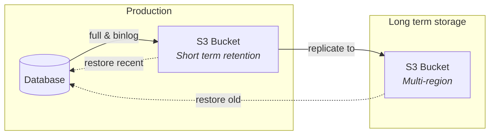
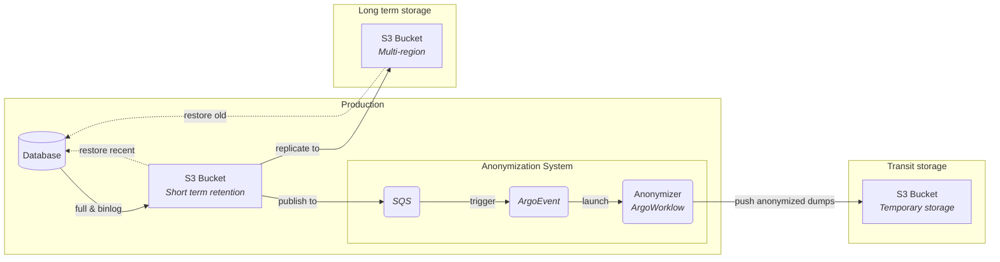
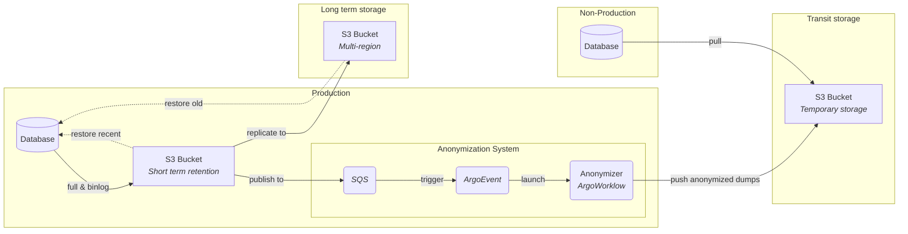

This is an rough idea for a database backup and refresh system on AWS and Kubernetes.

# Context

- Multiple separated AWS Accounts: 
    - Production
    - Non-production
    - Transit storage
    - Long term storage

/// admonition | Why multiple accounts?
    type: question

A multiple accounts configuration enables better and more secure separation of the workload and data. Which is a "must have" regarding backup policy and production isolation from lower environments.
///

# Diagrams

/// tab | Main layer

///

/// tab | Anonymization layer

///

/// tab | Refreshing layer

///