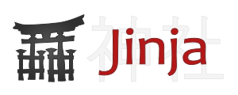
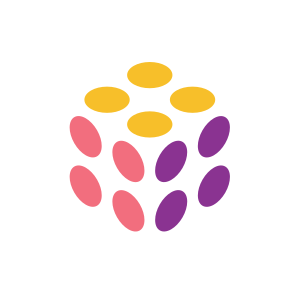

# Kiwy

Kiwy was a project I submitted to an internal innovation program[^1]. Its main purpose is to greatly reduce boilerplate
work when provisioning infrastructure by develop infrastructure abstraction, reusability and dependencies automation.
Said otherwise, enabling procedural generation for infrastructure and application deploy. Another way to put this:
creating a managed infrastructure that you own and control completely.

[^1]: It was not retained, maybe because there was not enough "AI" (LLM) involved to be called "innovative" by the
corporates in 2024...

[//]: # (@formatter:off)
/// admonition | A typical situation
    type: example
Imagine a company or a teams who need a fully set up Kubernetes cluster with all the support features for deployment, 
security and documentation (1). We would need an infrastructure with subnets, gateways, nodes, etc.
{ .annotate }

1. ArgoCD, Kyverno, Karpenter, Crossplane... All the possibilities offered by the Kubernetes ecosystem.

With Kiwy, you'll just have to put together a relatively small IaC project, configure the main providers 
(such as Cloud providers), then import the relevant modules and run the project. Since every thing is packaged, 
all the best practices are already implemented and adapted to your request.

In a few hours, you'll have an infrastructure ready-to-go. That was the goal of Kiwy.
///
[//]: # (@formatter:on)

[//]: # (@formatter:off)

- { style="height:25px"; align=left } Python
- { style="height:25px"; align=left } Jinja2
- { style="height:25px"; align=left } Git
- { style="height:25px"; align=left } ArgoCD
- { style="height:25px"; align=left } Pulumi
- ...

[//]: # (@formatter:on)

## Leverage

Kiwy achieves its magic by leveraging multiple principles, among them:

/// define
Abstraction

- Hiding concrete implementation details behind an interface: the black box principle.
- Enables fast multi-cloud by simply switch the abstract factories modules/packages.

Reusability

- Making things generic yet customizable enables greatly reduce the need to "reinvent the wheel" each time.
- The work of one person benefits dozens of others.

Completeness

- With the Kiwy IDK, packages finds helpers to generate all the boilerplate work: documentation, monitoring &
  observability, naming conventions, etc

Pro-activity

- Doing quality work requires a lot of time. Often, companies ends up cutting corners to meat the deadlines. In the
  worst cases, it leads to poor monitoring, architecture, security, documentation, reporting... The infamous "temporary"
  thing that will be improved later (also called technical debt)
- With Kiwy, all this work was done before, drastically increasing the overhaul quality, stability, security, etc.

///

## Technology stack for IDK

There's little to choose because of the polyvalence nature of Kiwy. Like any IaC tool, it should be flexible enough to
handle all the technologies we need. It will be to te community to create plugins and packages for the desired techs.

### Infrastructure as Code: Pulumi

Pulumi is, like Terraform, a tool to transform code into resources (like Virtual Machines, Kubernetes clusters, network
components...).

The main difference reside in the language of the code. Where Terraform is limited by the declarative nature of HCL,
Pulumi uses real programming language (1). Pulumi has the power of Terraform PLUS the power of a programming language.
This enables the possibility of abstraction and advanced coding principles required to achieve Kiwy's goals.
{ .annotate }

1. Go, Java, C#, Typescript and of course: Python

#### IaC language: Python

Since Pulumi is available in Go, Java, C# Typescript and Python. We need to choose one. For the POC, I choose Python
since it's the language I'm the most proficient with. Go is also a good choice since Pulumi is written in Go like many
cloud tools and libraries.

## Documentation: MkDocs material

Kiwy relies on automation, the documentation should be automated as well. The documentation should be plain text and
easily editable then published through pipelines. MkDocs enables static website building from Markdown files, this
is perfect for our goals. MkDocs Material is an Open Source superset of MkDocs that adds many features to the
websites.[^2]

[^2]: This resume was built with MkDocs Material then publish to GitHub Pages through a pipeline.

## Concepts

Now that we have the ground technologies, principles and goals. Let's talk about the concepts introduced by Kiwy.

### Component

A component is the smallest unit in the Kiwy IDK. It is a concrete implementation of
a [Component Interface](#component-interfaces).

The main difference between a Kiwy Component and a Pulumi component resides in the packaged elements. A component is
considered complete if it fulfill all the following requirements.

#### Metadata

* Naming conventions
* Tagging & Labelling conventions

#### Deploys resources

* Core resources (Server, Network, etc)
* Monitoring & Observability resources
* Backup resources
* Security resources
* Reporting resources

#### Documentation resources

**Public documentation**

* Use cases
* Configuration
* Update & Upgrade procedures
* Changelogs

**Exploitation documentation**

Documentation containing the specificities of the company context. Private documentation.

* Architecture module
* Exploitation procedures
* Exploitation recurring tasks
* Incident procedure
* DRP
* Monitoring & Observability
* Use cases

#### CI/CD

At the component level, before release, all kind of tests must be performed to enforce quality.

### Component Interfaces

A component interface is the contract between the factory or user and the component itself. It defines what information
and actions are available on the component. Much like a Kubernetes apiVersion and kind.

### Factory

Direct implementation of the Factory design pattern, it encapsulates the creation of a component in a function.

### Abstract factory

Direct implementation of the Abstract Factory design pattern. It encapsulates the creation of multiple kinds of
component in one place.

Abstract factories also implement an interface: if a developer needs a Kubernetes cluster, they don't need to know if
is deployed on AWS, Azure, GCP, OpenShift... The additional layer of abstraction allows easier switch/expend to
another cloud provider per example.

## Conclusion

This is a very brief overview of the Kiwy project. There are many, many things to tell about it (I have a full
binder of it). The project was promising, or at least worth to explore. I have hope that one day, I'll be able to work
on it again !