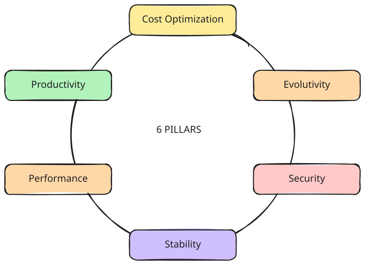

# Evaluate an Idea with 7 Pillars

The pillars are a method I use to filter out ideas by estimating their potential return on investment (ROI) and their
impact on key areas. If the idea does not show sufficient promise in at least one pillar, it is immediately archived.

//// admonition
    type: tip

This method **does not aim to replace** any other approach. Instead, it serves as a simple tool for engineers to filter
ideas **before** discussing them with managers, architects, or clients (for freelancers, too).

It is meant to be applied at the very beginning of the thought process. The internal dialogue could look something like
this:

/// tab | Dialog A

- This tech looks interesting.
- It could really benefit us in terms of productivity and cost optimization.
- Let's talk about it with the architect.

///
/// tab | Dialog B

- This tech looks interesting.
- However, it would require a tremendous amount of work for very little benefit in terms of stability.
- I’ll note the idea—it could be useful later, but not for now.

///
////

A pillar is a primary KPI (Key Performance Indicator) for the computer system across multiple services. To date, I’ve
identified 6 of them[^1].

[^1]: This method is still evolving and will likely be refined over time.

<figure markdown="span">

</figure>

## Pillars in a Nutshell

### Stability

Anything that reduces incidents, errors, uncontrolled resource usage bursts, etc.

Stability helps reduce the burden on the exploitation team, allowing them to focus on business evolution tasks.

The stability of the application, along with performance, is often directly visible to customers.

### Security

Anything that reduces the risk of data leaks, successful attacks, etc. Security is a vast topic on its own.

This pillar is often thankless: security is seen as a burden (additional work, costs, human resources) until it’s
needed.

### Performance

Anything that improves latency, resource consumption, provisioning reactivity, alerting reactivity, etc.

Application performance, alongside stability, is often directly noticed by customers.

### Productivity

Anything that reduces time-to-market for business projects, automates tasks, or optimizes organizational processes (
without sacrificing other areas).

More formally: anything that reduces the human time needed to complete the same tasks.

### Cost Optimization

Anything that reduces the overall cost of the computer system.

### Evolutivity

Anything that keeps the possibility for future evolution open. This pillar supports business growth.

It is rooted in development principles such as decoupling, abstraction, and design patterns.

### Enthousiasm

Last but not least, enthousiasm of the people working on the computer system is the cornerstone of an healthy organization.

In one word, it keeps the people engaged and motivated with the project.
Taking good care of the enthousiasm prevents turnover and clogging.

In the end, it helps to prevent technical and operational debts.
