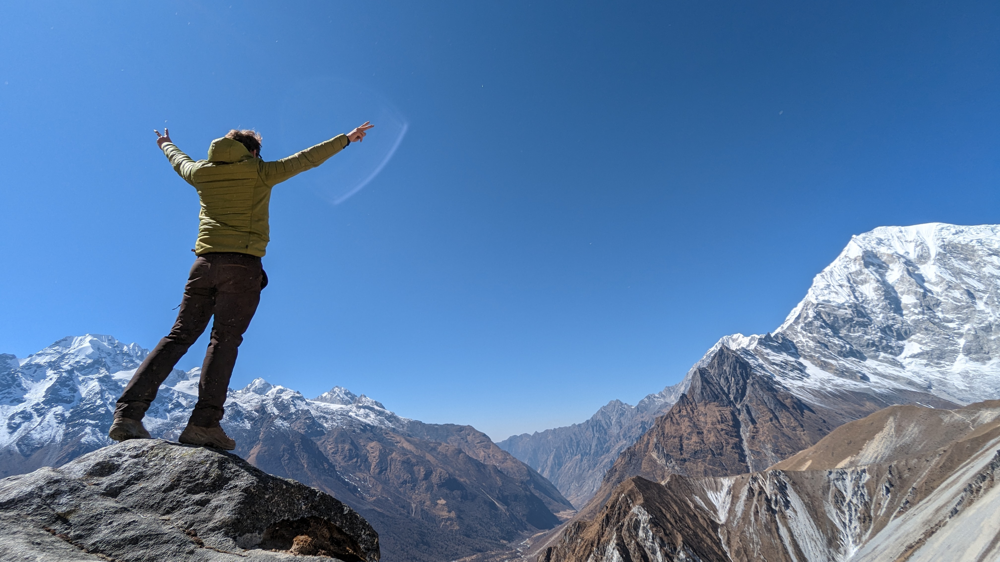

---
hide:
  - navigation
---

# Resume

## Profile

<figure markdown="span">
{height=300px, style="height:300px; width:300px; object-fit:cover;object-position:10% 0; border-radius:50%;"}
</figure>
Results-driven **DevOps Engineer** with extensive experience in **automating workflows**, optimizing infrastructure, and
implementing continuous integration/continuous deployment (CI/CD) **pipelines** using Kubernetes, AWS, and Linux to enhance
system **performance** and **reliability**.

## Contact details

[//]: # (@formatter:off)

- :material-human-male:{ .lg .middle; style="margin-right: 25px" }  __LIORET__ Robin
- :material-phone:{ .lg .middle; style="margin-right: 25px" }  +33(0) 6 59 55 50 84
- :material-email:{ .lg .middle; style="margin-right: 25px" }  robin.lioret.epro@gmail.com
- :material-linkedin:{ .lg .middle; style="margin-right: 25px" }  [LinkedIn profile](https://www.linkedin.com/in/robin-lioret-1a278b89)
- :material-github:{ .lg .middle; style="margin-right: 25px" }  [GitHub profile](https://github.com/robinlioret)
- :simple-credly:{ .lg .middle; style="margin-right: 25px" }  [Credly profile](https://www.credly.com/users/robin-lioret.08e8ea51)

[//]: # (@formatter:on)

### Languages

[//]: # (@formatter:off)

- :flag_fr:{ .lg .middle; style="margin-right: 25px" }  French: native
- :flag_gb:{ .lg .middle; style="margin-right: 25px"}  English: fluent (TOEIC C1)

[//]: # (@formatter:on)

## Personal values

[//]: # (@formatter:off)

- :fontawesome-solid-graduation-cap:{ .lg .middle } __Learn everyday__

    ---

    Computer science is vast and offers nearly infinite ways to combine concepts. I believe that consistent learning is
    key to improving every day.

- :material-share-variant:{ .lg .middle } __Share__

    ---

    Sharing knowledge with coworkers is a fulfilling way to grow as an individual, a team member, and an engineer.

- :material-clock-fast:{ .lg .middle } __Take the time to do fast__

    ---

    Taking the time to build complete solutions is often more effective in the long term than relying on temporary
    implementations or cutting corners to save time.

- :fontawesome-solid-sun:{ .lg .middle } __Keep things light__

    ---

    The brain is more effective in a lighter mood. I learned this in aeronautics, and it serves me well even in the most
    critical situations.

- :material-scale-balance:{ .lg .middle } __Team Work__

    ---

    The computer science industry has many moving parts, and if one cannot manage all aspects by themselves, they
    should rely on their teammates.

- :material-scale-balance:{ .lg .middle } __Communicate genuinely in goodwill__

    ---

    With a spirit of goodwill, I strive to express my gratitude and concerns in a direct yet respectful manner.

[//]: # (@formatter:on)

## Skill domains

<figure markdown="span">

 <figcaption>There is more than shown in the above diagram !</figcaption>
[See skills](./skills/index.md){ .md-button }
[See portfolio](./portfolio/index.md){ .md-button }
</figure>

## Certifications

[//]: # (@formatter:off)

-   [{ style="height:100px"; align=left  }](https://www.credly.com/badges/98ebc4cc-d7aa-4807-93d6-f7977086041c/public_url)
    __AWS Certified Cloud Practitioner__
     [:octicons-arrow-right-24: See on Credly](https://www.credly.com/badges/98ebc4cc-d7aa-4807-93d6-f7977086041c/public_url)

-   [{ style="height:100px"; align=left  }](https://www.credly.com/badges/aee73c36-9980-4ce6-b8cd-110f287a0fb6/public_url)
    __Certified Kubernetes Administrator__
     _Kubestronaut program_
     [:octicons-arrow-right-24: See on Credly](https://www.credly.com/badges/aee73c36-9980-4ce6-b8cd-110f287a0fb6/public_url)

-   [{ style="height:100px"; align=left  }](https://www.credly.com/badges/26a90afc-48be-41d9-ae7f-122f0db79146/public_url)
    __Certified Kubernetes Application Developer__
     _Kubestronaut program_
     [:octicons-arrow-right-24: See on Credly](https://www.credly.com/badges/26a90afc-48be-41d9-ae7f-122f0db79146/public_url)

-   [{ style="height:100px"; align=left  }](https://www.credly.com/badges/a11fe645-e40f-4ff3-86c6-bfda4506451a/public_url)
    __Microsoft Certified: Azure Fundamentals__
     [:octicons-arrow-right-24: See on Credly](https://www.credly.com/badges/a11fe645-e40f-4ff3-86c6-bfda4506451a/public_url)

-   [{ style="height:100px"; align=left  }](https://www.credly.com/badges/ecd002fa-0eef-435f-a71b-069097cf7a42/public_url)
    __HashiCorp Certified: Terraform Associate__
     [:octicons-arrow-right-24: See on Credly](https://www.credly.com/badges/ecd002fa-0eef-435f-a71b-069097cf7a42/public_url)

[//]: # (@formatter:on)

### Ongoing certifications

[//]: # (@formatter:off)

{ .lg middle; style="height: 50px; margin-right: 20px; display: flex"; align=left }  __Certified Kubernetes Security Specialist__ _Kubestronaut program_
{ .card }

{ .lg middle; style="height: 50px; margin-right: 20px; display: flex"; align=left }  __Kubernetes and Cloud Native Associate__ _Kubestronaut program_
{ .card }

{ .lg middle; style="height: 50px; margin-right: 20px; display: flex"; align=left }  __Kubernetes and Cloud Security Associate__ _Kubestronaut program_
{ .card }

{ .lg middle; style="height: 50px; margin-right: 20px; display: flex"; align=left }  __AWS Architect Associate__
{ .card }

[//]: # (@formatter:on)

## Professional Experience

### Computer science experience

#### Daryl Social Software

[//]: # (@formatter:off)
/// admonition | From August 2025 ongoing (Full time)
    type: tip
///
[//]: # (@formatter:on)

I'm in charge of a migration from on-primise workloads and infrastructure to AWS and Kubernetes. I'm working with developer teams to find the best automation to reduce friction and fludify the development processes.

#### Capgemini

[//]: # (@formatter:off)
/// admonition | From November 2021 to July 2025 (Full time)
    type: note
///
[//]: # (@formatter:on)

I first served as an Infrastructure Analyst, where I gained experience in Linux, networking, automation, and cloud
infrastructure on AWS. Then, I transitioned to a DevOps engineer role focused on Kubernetes. I am primarily responsible
for:

* Stability and evolution
* Security and permissions
* Leading projects to [consolidate key pillars](gists/pillars.md)

My tasks are diverse and enriching, ranging from basic daily maintenance tasks, such as managing storage, network
traffic, or users, to more advanced and complex ones, including:

* Kubernetes administration
* Advanced AWS configurations: permissions, security, performance, etc.
* Supply chain management (**CI/CD pipelines**, Git repositories, **GitOps** implementation)
* Automated **documentation** generation
* And many more...

[Take a look at my portfolio](./portfolio/index.md){ .md-button }

### Other meaningful experiences

#### PSDK (OpenSource community project)

[//]: # (@formatter:off)
/// admonition | From 2011 until 2021 (Part time)
    type: note
///
[//]: # (@formatter:on)

[PSDK](https://pokemonworkshop.com/fr/sdk) is an open-source, community-driven game engine and editor that was launched
in 2015 following the retirement of PSP. It provides all the necessary tools for individuals to create their own games.

I worked as a developer for the project. My responsibilities included **identifying areas for improvement** and
implementing changes in Ruby. I also **led several complex projects**, such as developing a Pathfinding algorithm,
implementing advanced player interactions, and more.

[//]: # (@formatter:off)
/// admonition |
    type: abstract
It was unpaid work carried out by passionate individuals in their free time. I am grateful and honored to have had the
opportunity to learn alongside them!
///
[//]: # (@formatter:on)

#### Action Training Production - Stuntman

[//]: # (@formatter:off)
/// admonition | From 2011 to 2012 (Part time)
    type: note
///
[//]: # (@formatter:on)

As a stuntman, I performed stunts such as rolling over moving vehicles, setting myself on fireand other dangerous
weapons, rappelling down viaducts, and choreographing fight scenes. It was a time of learning in high-risk environments:

- **Quick-thinking**: Many situations required fast and accurate reactions. I learned how to optimize my thought process
  to respond appropriately to urgent circumstances. Surprisingly, I found that this skill was transferable to
  intellectual domains, such as computer science.

- **Anticipation**: While stunts often appear natural and dynamic, there is extensive preparation involved. The more
  dangerous the stunt, the more we need to study and anticipate potential accidents. I learned to foresee and prepare
  for the worst while hoping for the best—another skill that surprisingly translated well into computer science.

#### Drone Process - Civilian drone pilot and instructor

[//]: # (@formatter:off)
/// admonition | From 2013 to 2017 (Part time)
    type: note
///
[//]: # (@formatter:on)

With a retired French Air Force pilot, we founded our own company and embraced new technology (which was cutting-edge at
the time).

My tasks were varied: piloting drones equipped with high-tech cameras to create photogrammetry models for land surveyor
companies, flying thermal imaging cameras over solar plants to collect data for researchers, and performing artistic
drone ballets for the opening of a large company campus (1)...
{ .annotate }

1. This was done with a pilot, before the ballets were made of hundreds of programmed drones.

This activity provided a fertile environment for acquiring a wide range of transversal principles that I now apply in my
daily work. Among them:

- **Ensure fail-safety**: Always have a rollback or backup plan in case of failure.
- **Always prepare**: As we used to say, a well-prepared operation is a well-executed operation.
- **Have eyes everywhere**: This helps anticipate most unexpected incidents.

The work involved strict regulatory compliance and **rigorous processes and procedures to ensure security and safety**.

After a year, we established the Drone Process Training school, and I became an instructor. In this role, I learned
numerous **andragogical[^1] strategies and tactics** to effectively transfer my knowledge.

[^1]: Pedagogy, but specifically for adults.

## Education

[//]: # (@formatter:off)

- :fontawesome-solid-graduation-cap:{ .lg .middle } __2011: Baccalaureate__

    ---

    At Lycée Monge (Chambéry), with mention.

    Engineering science with a mathematics speciality.

- :octicons-goal-16:{ .lg .middle } __2015: General purpose coaching formation__

    ---

    With ECF (Ecole de Coaching Francophone)

    Main skills: goal specification, strategic thinking, self-awareness, communication, etc.

[//]: # (@formatter:on)

## Hobbies

- Critical thinking
- Swimming, Climbing, Running, Cycling
- Programing, exploration, open source
- Fiction writing
