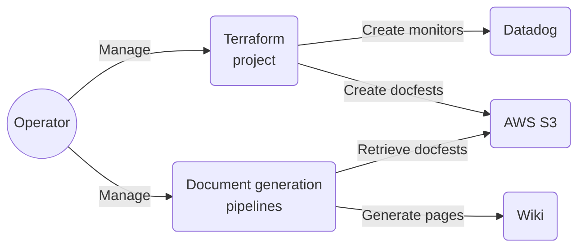

# Datadog monitoring with IaC

Enable complete, replicable and refactored monitoring setup by creating IaC modules with Terraform.

[//]: # (@formatter:off)
<div class="grid cards" markdown>
- { style="height:30px"; align=left } Terraform
- { style="height:30px"; align=left } Datadog
- { style="height:25px"; align=left } AWS
</div>
[//]: # (@formatter:on)

[//]: # (@formatter:off)
/// admonition |
    type: tip
This project involves a significant amount of innovation to tackle the challenges of generating fully automated 
documentation alongside fully automated Terraform resources.
///
[//]: # (@formatter:on)

## Need & Benefits

When it comes to monitoring, the system can easily scale to hundreds of monitors, each tracking thousands of items.
While some monitors are global, there are many exceptions. In addition to the usual configuration updates, we aimed to
create a system that provides the exploitation team with clear, actionable instructions for each alert or warning.

This leads to the following set of needs:

* Replicability
* Versioned
* Flexibility & Customization
* Add extra documentation natively
* Oncall management
* Modification tracking (through tickets)

[//]: # (@formatter:off)
/// admonition | There are many additional smaller requirements and needs, but only the main ones are listed here.
    type: info
///
[//]: # (@formatter:on)

## My roles & Missions

[//]: # (@formatter:off)
<div class="grid cards" markdown>
- <b>Lead</b><br/>I presented the project and taken it to its full potential.
- <b>Engineer</b><br/>I perform the realisation of the project.
- <b>Maintainer</b><br/>I'm maintaining the project and continuously improving it.
</div>
[//]: # (@formatter:on)

## Key information

[//]: # (**Number of monitors created**: more than 200 at this moment, more are planned.)

**Number of person involved**: 4 (manager, me, two members of the exploitation team)

**Project duration**: 2 month (in parallel of many other topics)

**Related project**: [Documentation automation](./documentation-automation.md)

## Global workflow goal



## Concepts

[//]: # (@formatter:off)
/// admonition | Disclaimer
    type: info
* Since this is a large and complex project, I won't be able to put all the details in here.
* This page is intended for technical people with a good understanding of Terraform and basic knowledge of Datadog.
///
[//]: # (@formatter:on)

### Documentation manifests (Docfest)

An external JSON or YAML file contains all the necessary information for generating the documentation.

This approach offers the key benefit of decoupling the Terraform code from the documentation generation process,
resulting in easier maintenance and evolution. With a clear API contract, both components can be managed and maintained
by separate teams or individuals.

[//]: # (@formatter:off)
/// details | Docfest example
    type: example

Here is an incomplete example of what a docfest can look like.

```yaml
apiVersion: docfest.io/v1alpha1
kind: DatadogMonitor
metadata:
  name: my-monitor-prod
  labels:
    environment: prod
    perimeter: my-company-app
    cern: my-monitor
spec:
  tags:
    createdby: terraform
    team: devops
  query: >-
    min(last_5m):avg:aws.ec2.cpuutilization{env:prod} by {name} >= 90
  threshold_alert_trigger: 90
  threshold_alert_recovery: 80
  instructions_critical_trigger: |
    1. Connect to the server
    2. Identify the process that consumes the most CPU
    3. If applicative, contact the team in charge
    4. If system, find the appropriate documentation and troubleshoot
    
    Anti-virus can consume a lot of CPU sometimes. If it is the case, look for the logs, the server 
    may have been infected.
```
YAML and JSON may not be the most visually appealing formats for beginners, but they can easily be used in a script and 
template to generate clean, well-structured Markdown documents.
///
[//]: # (@formatter:on)

[//]: # (@formatter:off)
/// admonition | Docfests resemble Kubernetes manifest
    type: abstract
Docfests are intentionally designed to resemble Kubernetes manifests. First, this allows us to differentiate between 
various APIs. Second, it lays the groundwork for potentially creating a controller in the future to further automate 
the documentation generation process.

The concept of docfests extends far beyond this project, as it applies to everything we can deploy with IaC and more.
///
[//]: # (@formatter:on)

In the end, docfests play a key role in this project. They allow us to add as much documentation and information as
needed without forcing anything into Datadog. This approach provides both flexibility and control over our
documentation.

### Module `monitor-base`

A Terraform module that abstracts the creation of both the monitor and its associated docfest. This serves as the core
unit of the system.

### Key Features

- **Comprehensive Configuration Support**  
  Access all available Datadog provider configurations, along with documentation-specific variables.

- **On-Call Management**  
  Streamline on-call schedules and responsibilities.

- **Ticket History Tracking**  
  Maintain a detailed record of ticketing activity.

- **Notification Management**  
  Efficiently handle and customize notifications.

- **Docfest Export Configuration**  
  Export documentation seamlessly, either locally or to an AWS S3 bucket.

- **Asset Sources and Overrides Processing**  
  Process asset sources with support for overrides.

- **Automated Naming Conventions**  
  Simplify and enforce consistent naming standards.

- **And Much More!**  
  Explore additional features designed to enhance productivity and efficiency.

### Module `monitors-group`

A Terraform module that manages multiple monitors.


[//]: # (@formatter:off)
/// admonition | The main feature of this module is its ability to manage a default monitor and many specifics
    type: tip
///
[//]: # (@formatter:on)

#### Default & Specifics

That is the most complicated feature of this project: enabling both global and detailed specific monitoring.

To achieve this, I introduced the concept of **selectors**. Selectors are Datadog query components that refine the final
result.

We have three types of selectors:

- **Base Selector**  
  Applied to all queries. Ideal for tasks like environment selection.

- **Default Selector**  
  Applied only to the default query. Useful for disabling monitoring on certain items.

- **Specific Selectors**
    - One selector per specific monitor.
    - Applied directly to specific monitors.
    - Inverted for the default monitor to exclude specifics from it.

To illustrate the logic:


#### Items

There is an issue with the current implementation: while we can build specific queries using Terraform templates and
strings, the documentation cannot list all the items monitored by these queries (such as services or endpoints).

[//]: # (@formatter:off)
/// admonition | This issue could lead to delay in the contractual delivery and reporting (management tasks)
    type: warning
We would like to have a clean view of the items monitored by the specifics.
///
[//]: # (@formatter:on)

Introducing **items**:  
Items are simply variables within the module. If present, they are used to generate the selector.


[//]: # (@formatter:off)
//// admonition | Example
    type: example
/// tab | Without items
```terraform
module "group-without-items" {
  # ...
  specifics = [{
    name_suffix = "without_items"
    selector = "(${join(") OR (", [
        "service:service01 AND resource_name:post_/endpoint/abc",
        "service:service02 AND (resource_name:post_/endpoint/abc OR resource_name:post_/endpoint/xyz OR resource_name:post_/endpoint/def)"
      ])})"
  }]
}
```
///
/// tab | With items
```terraform
module "group-with-items" {
  # ...
  specifics = [{
    name_suffix = "with_items"
    selector = "($${join(") OR (", items_formatted)})"
    item_format = "service:$${service} AND resource_name:$${method}_$${endpoint}"
    items = [
      {service = "service01", method = "post", endpoint = "/endpoint/abc"},
      {service = "service02", method = "post", endpoint = "/endpoint/abc"},
      {service = "service02", method = "post", endpoint = "/endpoint/xyz"},
      {service = "service02", method = "post", endpoint = "/endpoint/def"}
    ]
  }]
}
```
///
////
[//]: # (@formatter:on)

By providing more readable code, **items** will also be used by the documentation to generate a list of what is
monitored by the specifics.

### Overridable assets

To further decouple the documentation and other assets subject to frequent changes, **assets** can be made overridable.

The Terraform module accepts a list of asset sources (directories). When searching for an asset, it iterates through the
sources and returns the first valid one.

[//]: # (@formatter:off)
//// admonition | Example of an instructions override
    type: example

All monitors currently share the same default instructions (which are empty). However, we aim to define specific 
instructions for handling CPU, memory, and latency alerts.

- **Monitor Default Instructions**  
  Common instructions that apply to every monitor of the same type. Typically generic.

- **Environment-Specific Instructions**  
  Instructions that vary based on the environment, such as production, staging, or development.

- **Server-Specific Instructions**  
  Some servers may require unique actions, like handling memory-related alerts differently.

/// tab | File structure
We can organize our assets like so:

```
.
└── assets/
    ├── defaults/
    │   ├── instructions-critical.md
    │   ├── description_long.md
    │   ├── query.tftpl
    │   └── name.tftpl
    └── cpu-utilization/
        ├── defaults/
        │   ├── instructions-critical.md
        │   ├── description_long.md
        │   └── query.tftpl
        └── prod/
            ├── defaults/
            │   ├── query.tftpl
            │   └── instructions-critical.md
            └── my-special-server/
                └── instructions-critical.md
```

At first, this approach may seem more complicated than necessary. However, monitoring inevitably scales to hundreds, 
if not thousands, of monitors. It’s better to start with a strong and organized foundation.
///

/// tab | Terraform pseudo code
```terraform
module "my-monitor-prod" {
  # Default monitor configuration
  basename = "ec2_cpu_utilization"
  asset_sources = [
    "assets/cpu-utilization/prod/defaults", 
    "assets/cpu-utilization/defaults", 
    "assets/defaults"
  ]
  # ...
  
  # Specific monitors that create exceptions on the default one
  specifics = [{
    name_suffix = "my_special_server"
    selector = "server_name:my-special-server"
    asset_sources = [
      "assets/cpu-utilization/prod/my-special-server", 
      "assets/cpu-utilization/prod/defaults", 
      "assets/cpu-utilization/defaults", 
      "assets/defaults"
    ]
    # ...
  }]
}
```
///

/// tab | Result
As a result, we will have two monitors:

- **Default Monitor**  
  Monitors CPU utilization for all servers (except the special one).

- **Special Server Monitor**  
  Dedicated to monitoring the CPU utilization of the special server.

Note: Only the instruction-critical asset was overridden for the special monitor. All other assets were retrieved from lower-priority sources.
///
Even though this example is largely incomplete, it provides insight into how overridable assets work.
////
[//]: # (@formatter:on)


[//]: # (@formatter:off)
/// details | Overridable assets code
    type: abstract
To achieve this feature, the code is not even that complicated.
```terraform
locals {
  __assets_names = [
    # ...
    "query.tftpl",
    "description_long.md",
    "instructions_alert_recovery.md",
    "instructions_alert_trigger.md",
    "instructions_no_data_recovery.md",
    "instructions_no_data_trigger.md",
    "instructions_warning_recovery.md",
    "instructions_warning_trigger.md",
    # ...
  ]

  # Raise an index error if no valid template was found.
  templates = {
    for asset_name in local.__assets_names :
    asset_name => compact([
      for source in var.asset_sources :
      (fileexists("${source}/${asset_name}") ? "${source}/${asset_name}" : null)
    ])[0]
  }
}
```
///
[//]: # (@formatter:on)

## Conclusion

In conclusion, this project combines Terraform with Datadog with one primary goal: to enable fast, reliable, and
flexible monitoring operations.

It required advanced Terraform coding techniques and creativity, all while keeping things accessible to junior
engineers.

This project is designed to support monitoring operations for the long term.
