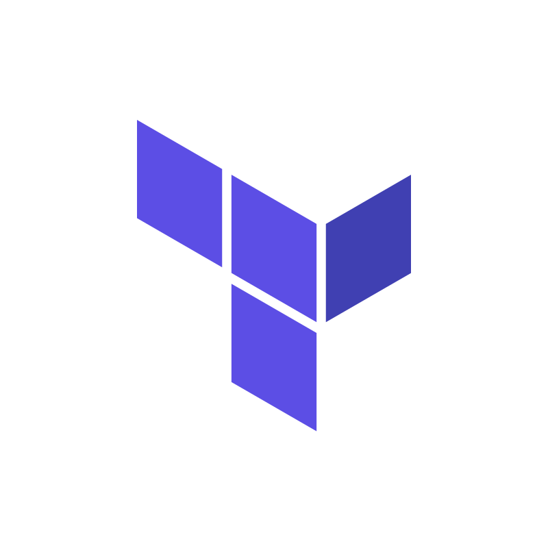
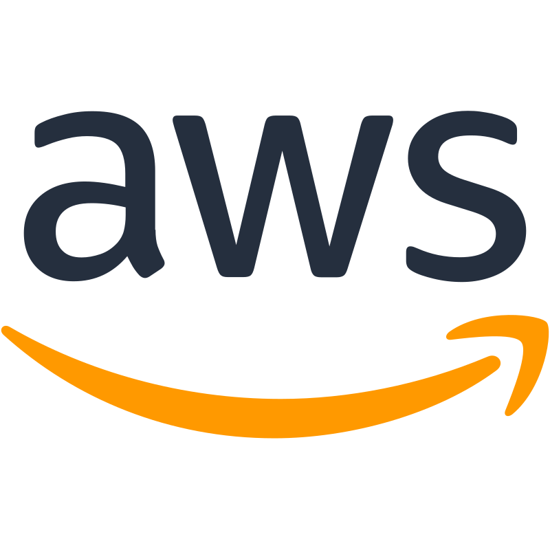
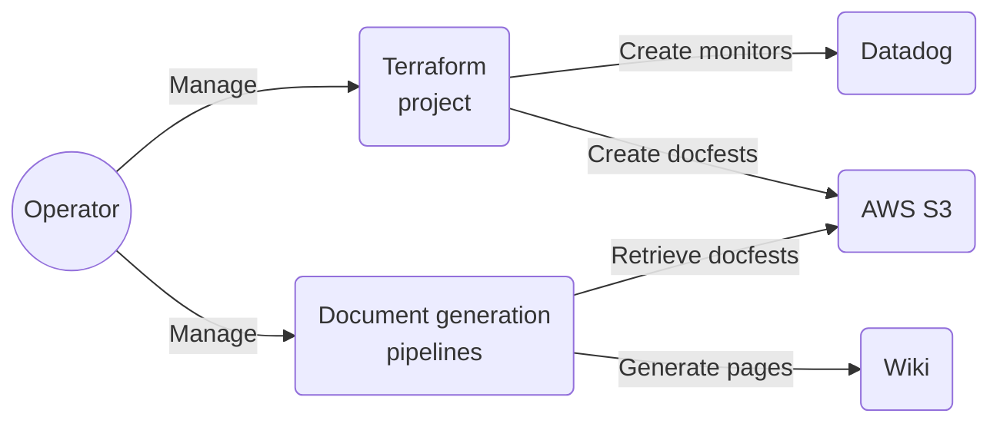
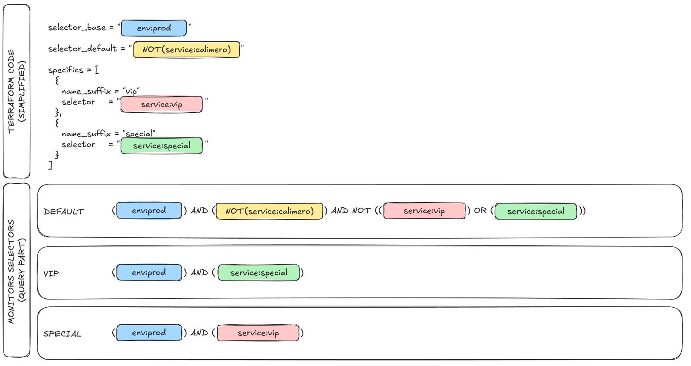

# Datadog monitoring with IaC

Enable complete, replicable and refactored monitoring setup by creating IaC modules with Terraform.

[//]: # (@formatter:off)
<div class="grid cards" markdown>
- { style="height:30px"; align=left } Terraform
- { style="height:30px"; align=left } Datadog
- { style="height:25px"; align=left } AWS
</div>
[//]: # (@formatter:on)

[//]: # (@formatter:off)
/// admonition |
    type: tip
This project includes a fair amount of innovation to overcome the challenges of creating fully automated documentation
alongside fully automated terraform resources.
///
[//]: # (@formatter:on)

## Need & Benefits

When it comes to monitoring, it can easily scale up to hundreds of monitors with thousands of monitored items. Some
monitors are global but there are many exceptions. Aside the usual evolutions of the different configurations, we wanted
a system that enables the exploitation team to have clear instructions for each alert or warning.

This leads to the following set of needs:

* Replicability
* Versioned
* Flexibility & Customization
* Add extra documentation natively
* Oncall management
* Modification tracking (through tickets)

[//]: # (@formatter:off)
/// admonition | There are many more smaller requirements and needs. Only the main ones were listed here.
    type: info
///
[//]: # (@formatter:on)

## My roles & Missions

[//]: # (@formatter:off)
<div class="grid cards" markdown>
- <b>Lead</b><br/>I presented the project and taken it to its full potential.
- <b>Engineer</b><br/>I perform the realisation of the project.
- <b>Maintainer</b><br/>I'm maintaining the project and continuously improving it.
</div>
[//]: # (@formatter:on)

## Key information

**Number of monitors created**: more than 200 at this moment, more are planned.

**Number of person involved**: 4 (manager, me, two members of the exploitation team)

**Project duration**: 2 month (in parallel of many other topics)

**Related project**: [Documentation automation](./documentation-automation.md)


## Global workflow goal



## Concepts

[//]: # (@formatter:off)
/// admonition | Disclaimer
    type: info
* Since this is a large and complex project, I won't be able to put all the details in here.
* This page is intended for technical people with a good understanding of Terraform and basic knowledge of Datadog.
///
[//]: # (@formatter:on)

### Documentation manifests (Docfest)

An external JSON or YAML file that contains everything need for the documentation generation to create the documents.

This approach has the key benefits of decoupling the Terraform code from the documentation generation. Leading to an
easier maintenance and evolution. With a clear API contract, both can be maintained by separated teams/people.

[//]: # (@formatter:off)
/// details | Docfest example
    type: example

Here is an incomplete example of what a docfest can look like.

```yaml
apiVersion: docfest.io/v1alpha1
kind: DatadogMonitor
metadata:
  name: my-monitor-prod
  labels:
    environment: prod
    perimeter: my-company-app
    cern: my-monitor
spec:
  tags:
    createdby: terraform
    team: devops
  query: >-
    min(last_5m):avg:aws.ec2.cpuutilization{env:prod} by {name} >= 90
  threshold_alert_trigger: 90
  threshold_alert_recovery: 80
  instructions_critical_trigger: |
    1. Connect to the server
    2. Identify the process that consumes the most CPU
    3. If applicative, contact the team in charge
    4. If system, find the appropriate documentation and troubleshoot
    
    Anti-virus can consume a lot of CPU sometimes. If it is the case, look for the logs, the server 
    may have been infected.
```
YAML and JSON not eye pleasing to neophytes, but it can easily be used in a script and template to generate beautiful Markdown documents.
///
[//]: # (@formatter:on)

[//]: # (@formatter:off)
/// admonition | Docfests resemble Kubernetes manifest
    type: abstract
Docfests resemble Kubernetes manifest on purpose. First because we need a wy to differentiate the different APIs. Then,
because we may create a controller down the road to further automate the documentation generation.

The docfest concept goes way further than this project because it applies to all the things we can deploy with IaC 
and more.
///
[//]: # (@formatter:on)

In the end, docfests plays a key role in this project. They enable us to add as many documentation and information as
we need without forcing anything into Datadog. They offer flexibility and power over our documentation.

### Module `monitor-base`

A Terraform module that abstracts the creation of the monitor and its docfest. This is the core unit of this system.

Key features:

* All Datadog provider available configurations + Documentation specific variables
* Oncall management
* Tickets history
* Notification management
* Docfest exportation configuration (local or AWS S3 bucket at the moment)
* Asset sources and overrides processing
* Naming convention automation
* And many more

### Module `monitors-group`

A Terraform module that manages multiple monitors.


[//]: # (@formatter:off)
/// admonition | The main feature of this module is its ability to manage a default monitor and many specifics
    type: tip
///
[//]: # (@formatter:on)

#### Default & Specifics

That is the most complicated feature of this project: how to enable both global and detailed specific monitoring.

To achieve this, I introduced the concept of selectors. They are Datadog query parts that restrain the final result.

We have three kinds of selectors :

* The base selector: applied to all queries. Great for environment selection per example.
* The default selector: applied only to the default query. Great to simply disable monitoring on some items.
* The specific selectors (one per specific monitor): applied as is to the specifics, inverted for the default monitor to
  exclude the specifics from the default monitor.

To illustrate the logic:



#### Items

There is an issue with the implementation so far: we can build specific queries using the Terraform templates & string.
But the documentation won't be able to list all the items monitored by them (such as service or endpoints).


[//]: # (@formatter:off)
/// admonition | This issue could lead to delay in the contractual delivery and reporting (management tasks)
    type: warning
We would like to have a clean view of the items monitored by the specifics.
///
[//]: # (@formatter:on)

Introducing items. Items are simply variables of the module. If present, they are used to generate the selector.


[//]: # (@formatter:off)
//// admonition | Example
    type: example
/// tab | Without items
```terraform
module "group-without-items" {
  # ...
  specifics = [{
    name_suffix = "without_items"
    selector = "(${join(") OR (", [
        "service:service01 AND resource_name:post_/endpoint/abc",
        "service:service02 AND (resource_name:post_/endpoint/abc OR resource_name:post_/endpoint/xyz OR resource_name:post_/endpoint/def)"
      ])})"
  }]
}
```
///
/// tab | With items
```terraform
module "group-with-items" {
  # ...
  specifics = [{
    name_suffix = "with_items"
    selector = "($${join(") OR (", items_formatted)})"
    item_format = "service:$${service} AND resource_name:$${method}_$${endpoint}"
    items = [
      {service = "service01", method = "post", endpoint = "/endpoint/abc"},
      {service = "service02", method = "post", endpoint = "/endpoint/abc"},
      {service = "service02", method = "post", endpoint = "/endpoint/xyz"},
      {service = "service02", method = "post", endpoint = "/endpoint/def"}
    ]
  }]
}
```
///
////
[//]: # (@formatter:on)

While providing a more readable code, items will be used by the documentation to generate a list of what's monitored by
the specifics.

### Overridable assets

To decouple even more the documentation and other assets subject to frequent changes, assets can be overridable.

The Terraform module receives a list of asset sources (directories). When looking for an asset, it iterates through them
and returns the first valid one.

[//]: # (@formatter:off)
//// admonition | Example of an instructions override
    type: example

All monitors have the same default instructions (which is empty), we want specific instructions to handle cpu, memory, 
latency alerts. Going further, those instructions are different in production than staging or dev. Going even further,
one server requires a specific action when handling memory related alerts.

/// tab | File structure
We can organize our assets like so:

```
.
└── assets/
    ├── defaults/
    │   ├── instructions-critical.md
    │   ├── description_long.md
    │   ├── query.tftpl
    │   └── name.tftpl
    └── cpu-utilization/
        ├── defaults/
        │   ├── instructions-critical.md
        │   ├── description_long.md
        │   └── query.tftpl
        └── prod/
            ├── defaults/
            │   ├── query.tftpl
            │   └── instructions-critical.md
            └── my-special-server/
                └── instructions-critical.md
```

It may seem more complicated than necessary at first. However, monitoring inevitably grows to hunder if not thousands 
of monitors. We better start with a strong organization.
///

/// tab | Terraform pseudo code
```terraform
module "my-monitor-prod" {
  # Default monitor configuration
  basename = "ec2_cpu_utilization"
  asset_sources = [
    "assets/cpu-utilization/prod/defaults", 
    "assets/cpu-utilization/defaults", 
    "assets/defaults"
  ]
  # ...
  
  # Specific monitors that create exceptions on the default one
  specifics = [{
    name_suffix = "my_special_server"
    selector = "server_name:my-special-server"
    asset_sources = [
      "assets/cpu-utilization/prod/my-special-server", 
      "assets/cpu-utilization/prod/defaults", 
      "assets/cpu-utilization/defaults", 
      "assets/defaults"
    ]
    # ...
  }]
}
```
///

/// tab | Result
As a result, we are going to have two monitors:

* The default one that monitors every servers cpu utilization (except our special one)
* The special server monitor

Note that only the instruction-critical asset were override for the special monitor. All the other assets were 
found in the lower priority sources.
///

Even if this example is largely incomplete, it provides an insight on how overridable assets works.
////
[//]: # (@formatter:on)


[//]: # (@formatter:off)
/// details | Overridable assets code
    type: abstract
To achieve this feature, the code is not even that complicated.
```terraform
locals {
  __assets_names = [
    # ...
    "query.tftpl",
    "description_long.md",
    "instructions_alert_recovery.md",
    "instructions_alert_trigger.md",
    "instructions_no_data_recovery.md",
    "instructions_no_data_trigger.md",
    "instructions_warning_recovery.md",
    "instructions_warning_trigger.md",
    # ...
  ]

  # Raise an index error if no valid template was found.
  templates = {
    for asset_name in local.__assets_names :
    asset_name => compact([
      for source in var.asset_sources :
      (fileexists("${source}/${asset_name}") ? "${source}/${asset_name}" : null)
    ])[0]
  }
}
```
///
[//]: # (@formatter:on)

