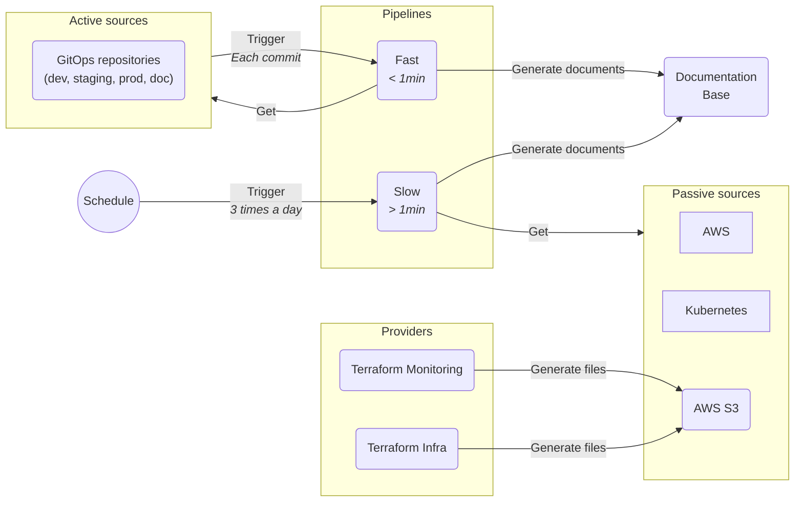

# Documentation automation

Automate the documentation generation to increase accuracy and productivity of the people working so they don't have to
worry about keeping a large chunk of documentation up-to-date.

[//]: # (@formatter:off)

- { style="height:25px"; align=left } Python
- { style="height:25px"; align=left } Jinja2
- { style="height:25px"; align=left } AWS
- { style="height:25px"; align=left } Azure DevOps
- { style="height:25px"; align=left } Git
- { style="height:25px"; align=left } Helm

[//]: # (@formatter:on)

## Need & Benefits

Computer systems can contain many a huge amount of little moving parts (more than 2 000 in this case). Keeping the
documentation up-to-date by hand takes a lot of time and boilerplate effort. The need for an automated solution was
obvious. We wanted something that updates automatically when someone changes something. A very wide scope that could not
be tackled in one sit.

## My Roles & Missions

[//]: # (@formatter:off)

- <b>Lead</b> I presented the project and taken it to its full potential.
- <b>Engineer</b> I perform the realisation of the project.
- <b>Maintainer</b> I maintained the project for a year and continuously improved on it.

[//]: # (@formatter:on)

## Progression

### Layout the basics

At first, we needed to decide how the generation would be done. We soon realized that there will be 3 kinds of elements
involved: the providers, the sources and the pipelines.

* The **providers** give the initial information. They could be human, git repositories, terraform configurations...
  Anything.
* The **sources** give access to the information to the pipelines. There are two kinds of sources: active and passive.
  The **active** ones trigger a fast pipeline, the **passive** ones just wait to be consulted.
* The **pipelines** are the actual workers in this set up. They collect the data and transform it into Markdown
  documents.

Together, it provides the following workflow:

[//]: # (@formatter:off)
/// admonition | Separation of the pipelines
    type: tip
As calling the AWS APIs to get information on thousands of resources takes a lot of time. We ended up separating the 
initial pipeline in half: one for the fast analysis of the git repositories, the other one for the long API information 
gathering.
///
[//]: # (@formatter:on)

### Enrich

At this point, the hardest part was behind us, or was it? With the groundwork done, we were finally free to add more
and more sources and automated document to our knowledge base.

We enrich the initial set up with multiple other resources such as:

* AWS API Gateways
* AWS SQS
* AWS RDS
* AWS SNS
* Datadog Monitors

In the end, it was more thant 10 000 lines of automatically generated documentation that would have take a tremendous
amount of time to maintain by hand.

#### Cross Environment Resource Name (CERN)

Resources are often duplicated across environments. We have many resources with similar names, often differentiated by a
suffix or prefix with the environment name. This is problematic when it comes to documentation: how should the
automation group the different resources to display a clear table of their configuration across the environments ?

Introducing the CERN, it is the same thing as the actual name of the resource minus the environment specific parts. If
the naming convention was respected in the first place, all duplicated resources will have the same CERN, regardless of
their environment.

Then, using something like a label or a tag, we can easily attribute the CERN to the resources. Downstream, this label
or tag is going to be used by the documentation generation to smart group the resources.

## Going further

Although this project was specific to a given context, it gave me an idea: what if we had a tool that does that in a
generic, yet customizable, way? That idea seduces me, we could slap it in a context and have documents generated on the
go. Imagine the amount of time saved!

I explored the possibilities on paper, layed out the base architecture and principles. Someday, I may have the time to
start it properly as an open source project.