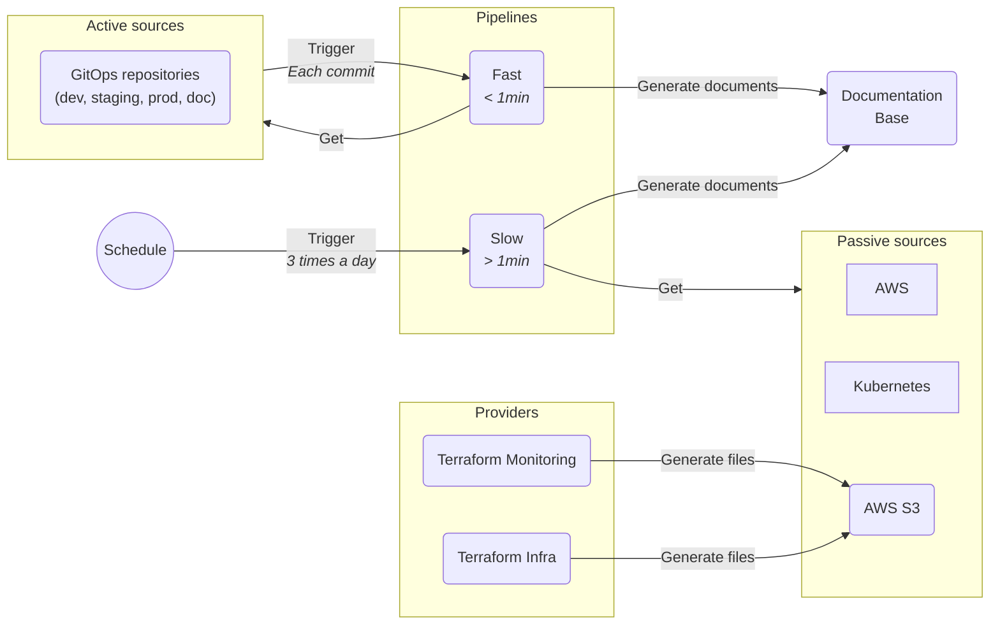

# Documentation Automation

Automating the documentation generation to increase accuracy and productivity for the people working, so they don't have to worry about keeping a large chunk of documentation up-to-date.

[//]: # (@formatter:off)

- { style="height:25px"; align=left } Python
- { style="height:25px"; align=left } Jinja2
- { style="height:25px"; align=left } AWS
- { style="height:25px"; align=left } Azure DevOps
- { style="height:25px"; align=left } Git
- { style="height:25px"; align=left } Helm

[//]: # (@formatter:on)

## Need & Benefits

Computer systems can contain a huge number of moving parts (more than 2,000 in this case). Keeping the documentation up-to-date by hand takes a lot of time and boilerplate effort. The need for an automated solution was clear. We wanted something that updates automatically when changes occur, covering a very wide scope that couldn’t be tackled in one sitting.

## My Roles & Missions

[//]: # (@formatter:off)

- <b>Lead</b> I presented the project and took it to its full potential.
- <b>Engineer</b> I performed the implementation of the project.
- <b>Maintainer</b> I maintained the project for a year and continuously improved it.

[//]: # (@formatter:on)

## Progression

### Layout the Basics

At first, we needed to decide how the generation would be done. We soon realized that there would be 3 kinds of elements involved: the providers, the sources, and the pipelines.

- **Providers**  
  These supply the initial information, whether from humans, git repositories, Terraform configurations, or anything else.
- **Sources**  
  These provide access to the information for the pipelines.  
  There are two types:
    - **Active sources** trigger a fast pipeline.
    - **Passive sources** just wait to be consulted.
- **Pipelines**  
  These are the actual workers in the setup. They collect data and transform it into Markdown documents.

Together, they form the following workflow:

[//]: # (@formatter:off)
/// admonition | Separation of the pipelines
    type: tip
As calling the AWS APIs to gather information on thousands of resources takes a lot of time, we separated the initial pipeline into two: one for the fast analysis of Git repositories, and another for long API information gathering.
///
[//]: # (@formatter:on)

### Enrich

At this point, the hardest part was behind us— or was it? With the groundwork in place, we were finally free to add more sources and automated documentation to our knowledge base.

We enriched the initial setup with multiple additional resources such as:

- AWS API Gateways
- AWS SQS
- AWS RDS
- AWS SNS
- Datadog Monitors

In the end, we had more than 10,000 lines of automatically generated documentation that would have taken a tremendous amount of time to maintain by hand.

#### Cross Environment Resource Name (CERN)

Resources are often duplicated across environments. Many resources share similar names, typically differentiated by a suffix or prefix indicating the environment. This poses a challenge for documentation: how can we group resources across environments in a clear, consolidated way?

Introducing the **CERN**—the Cross Environment Resource Name. This represents the resource's base name, excluding environment-specific parts. If the naming convention is respected, all duplicated resources will have the same CERN, regardless of the environment.

Then, using labels or tags, we can easily associate the CERN with the resources. This label or tag will later be used by the documentation generator to smartly group the resources.

## Going Further

Although this project was specific to a given context, it inspired an idea: what if we had a tool that could do this in a generic, customizable way? The idea captivated me—imagine deploying this tool in any context, and automatically generating documentation on the go. The potential time saved would be immense!

I explored the possibilities on paper, laid out the base architecture and principles. Someday, I may have the time to start it properly as an open-source project.
