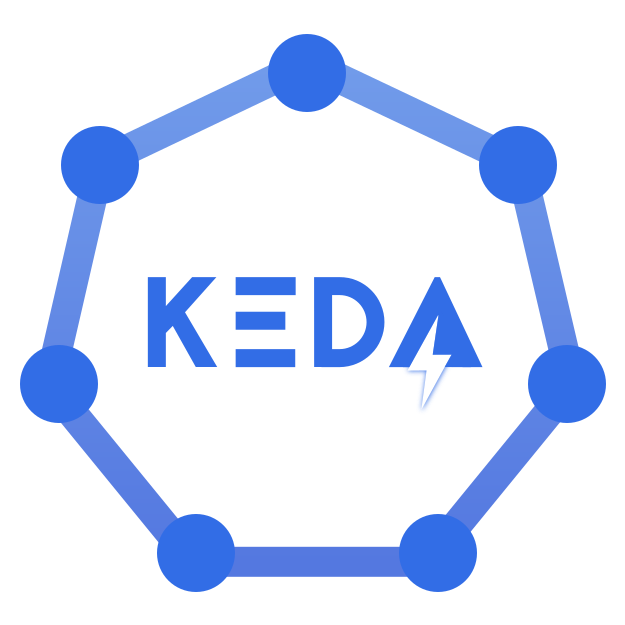
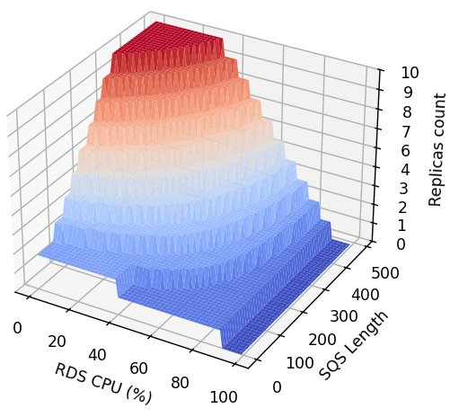

# Complex Scaling

Classically, pod auto-scaling is computed from the pods' resource consumption, such as Memory or CPU, and occasionally
from the number of HTTP requests sent to the service. This project emerged from an unusual request: scaling based on
multiple external metrics.

We wanted the auto-scaling to be driven by database CPU usage, the number of messages in multiple event queues, and
potentially many other factors.

[//]: # (@formatter:off)
<div class="grid cards" markdown>
- { style="height:25px"; align=left } AWS
- { style="height:25px"; align=left } Kubernetes
- { style="height:25px"; align=left } Helm
- { style="height:25px"; align=left } Keda
</div>
[//]: # (@formatter:on)

## Need & Benefits

Many services consume database resources, often to the extent that the database becomes overwhelmed and unavailable,
leading to application outages. To address this, we needed an auto-scaling solution capable of dynamically scaling
specific asynchronous services—either up, down, or completely disabling them—based on a combination of internal and
external metrics.

This type of scaling is complex and falls outside standard practices, but it provides significant benefits in optimizing
resource usage and preventing downtime.

## My Roles & Missions

[//]: # (@formatter:off)
<div class="grid cards" markdown>
- <b>Lead</b><br/>I presented the project and took it to its full potential.
- <b>Engineer</b><br/>I implemented the project.
</div>
[//]: # (@formatter:off)

## Progression

### POC

The first step was to create a Proof of Concept (POC) to confirm that it was indeed possible to implement the requested solution. I was given 3 days.

[//]: # (@formatter:off)
/// admonition | My skills at the time
    type: info
At the start of this project, I was new to Keda. While I was aware that Keda supports external metrics, I initially had 
no understanding of how it worked.

However, drawing on my experience with **procedural generation**, I was confident that once I confirmed Keda's 
capabilities, I could devise the appropriate formula to achieve the desired results.
///
[//]: # (@formatter:off)

I planned the POC in 3 steps:

1. **Explore Keda's capabilities**: Verify that combining external metrics for scaling was possible.
2. **Create a Helm chart version**: Develop a chart with the complex scaling configuration and deploy a dummy service to test it.
3. **Prepare restitution support**: Document and present the POC results effectively.

#### Explore Keda’s Capabilities

Keda is a powerful tool that supports external metrics. The real question was: could we combine them into a custom 
metric?

The answer was both yes and no. Keda provides **Scaling Modifiers**, which allow engineers to combine metrics using 
formulas. My task was to identify the correct formula. Initially, I created a simple formula to validate the concept, 
and it worked.  

**First step validated.**

#### Create a Helm Chart Version

I published a test version of a Helm chart to validate the GitOps deployment process, and it worked without any issues. 
Helm proved to be a powerful and flexible tool.

During this phase, I also experimented with formulas and explored Keda’s syntax to ensure we could eventually find a 
formula that met all requirements.

#### Prepare the Restitution Support

With the technical implementation complete, the final step was preparing the presentation. My goal was to manage the 
complexity and make the solution comprehensible for non-technical stakeholders.

To achieve this, I wrote a Python script to generate 3D graphs that visualized the scaling formulas. These graphs were 
instrumental in refining the final formula and making the concept accessible.

///tab | Example

{ align=right }

This graph illustrates the number of replicas as a function of the maximum number of messages across a set of queues and 
the database CPU utilization.

```
max(sqs_message_count_1, sqs_message_count_2) 
* max(0, 90 - cpu_rds_writer_percent) / 100
```
///

### Implementation

Following the successful POC (1), it was time to rebuild the solution from the ground up. I reworked the Helm charts to
incorporate the new scaling feature and prepared extensive documentation to ensure other DevOps engineers could work 
independently.
{ .annotate }

1. A POC is, by definition, a temporary draft. Temporary things should not go to production.

With the foundation in place, the focus shifted to designing new scaling formulas tailored to other
services, refining the approach to meet each service’s unique requirements.

Once the system was fully implemented, we onboarded additional services and successfully optimized database resource 
usage, achieving smarter and more efficient scaling.

