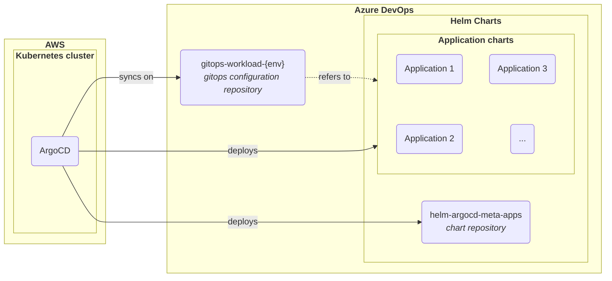
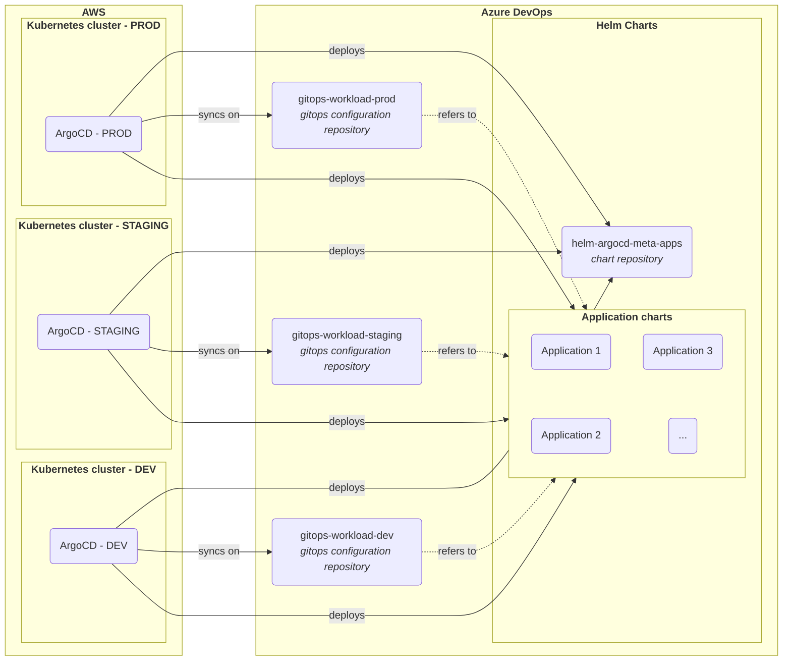

# GitOps Revamp

Complete rework of the previous GitOps implementation. This involves deploying new Kubernetes clusters for each
environment then perform the deployment of all the workload including production.

[//]: # (@formatter:off)

- { style="height:25px"; align=left } Kubernetes
- { style="height:25px"; align=left } ArgoCD
- { style="height:25px"; align=left } AWS
- { style="height:25px"; align=left } Helm
- { style="height:25px"; align=left } Azure DevOps
- { style="height:25px"; align=left } Git

[//]: # (@formatter:on)

[//]: # (@formatter:off)
/// admonition | Disclaimer
    type: info
This page is intended for technical people.
///
[//]: # (@formatter:on)

## Need & Benefits

The previous implementation of GitOps was flawed:

- Too permissive permissions
- All environments in the same repository, leading to unpractical change management and errors (modifying production by
  mistake)
- Complex code organization
- Helm charts embedded with the configuration code

## My Roles & Missions

[//]: # (@formatter:off)

- <b>Lead</b> I presented the project and taken it to its full potential.
- <b>Engineer</b> I perform the realisation of the project.

[//]: # (@formatter:on)

## Specification

I had to rethink the entire implementation. Here is a simplified overview of the code organization for one environment.

[//]: # (@formatter:off)
//// admonition |
    type: abstract
This shows one environment. Find after that a complete example for 3 environments (dev, staging and production)

/// details | Complete organization example
    type: example

///
////
[//]: # (@formatter:on)

While everything were in the same Git repository in the previous iteration, I separated the repositories. This ensures a
more controllable change management.

### Key benefits

With such organization (which is a standard in the GitOps practices), we gain many advantage over the previous
iteration.

The main ones are:

[//]: # (@formatter:off)

- <b>Permission control</b> It is easier to manage who can modify each environment.
- <b>Easy chart versioning and promotion</b> We can use git tags and branches like any other software part.
- <b>Clear change history</b> One history per element makes troubleshoot much more efficient.
- <b>Environment separation</b> Provides better control to promote changes.

[//]: # (@formatter:on)

## Progression

After writing the specification. We validated the solution. It was the moment to perform actions and promote the big
change toward production.

I build new clusters for each environment.

* First, because it made easier a rollback in case of issue (I was thinking in production mode from the start)
* Then, because there were a lot of development going on at the time. This way was the best to avoid disturbing
  developers during this project. And to keep every one productivity to its maximum.

Once the new clusters were up and running, we tested the switch and rollback in lower environments. Making sure that
everything was okay in both direction. Once secured. We moved on to production with minimum downtime.

## Conclusion

This was a large project that demanded more than 2 months of preparation and planning (1). But it was certainly worthy
of our time: it reduced the risks, improve tracking and change control. We discovered an unexpected benefit: people
started to like this new organization. That was a pleasant bonus!
{ .annotate }

1. I left out much of the complexity inherent to the company context for confidentiality reasons.