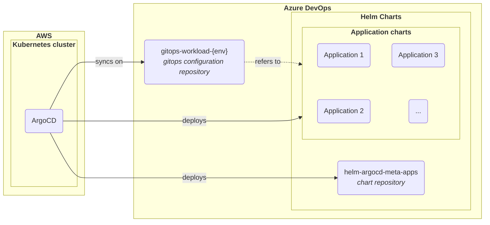
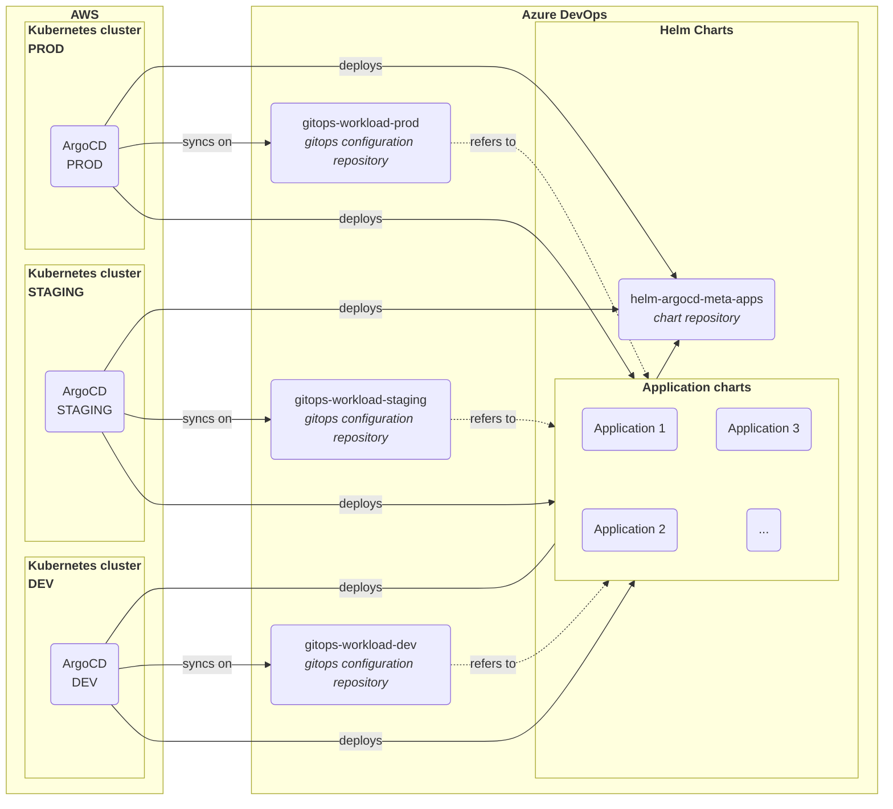

# GitOps Revamp

This project involved a complete rework of the previous GitOps implementation. It included deploying new Kubernetes
clusters for each environment and performing the deployment of all workloads, including production.

[//]: # (@formatter:off)

- { style="height:25px"; align=left } Kubernetes
- { style="height:25px"; align=left } ArgoCD
- { style="height:25px"; align=left } AWS
- { style="height:25px"; align=left } Helm
- { style="height:25px"; align=left } Azure DevOps
- { style="height:25px"; align=left } Git

[//]: # (@formatter:on)

[//]: # (@formatter:off)
/// admonition | Disclaimer
    type: info
* This page is intended for technical people.
///
[//]: # (@formatter:off)

## Need & Benefits

The previous implementation of GitOps had several flaws:

- Too permissive permissions
- All environments in the same repository, which led to poor change management and the risk of accidental modifications (e.g., modifying production by mistake)
- Complex code organization
- Helm charts were embedded within the configuration code
- More flexible GitOps bridge (Terraform to ArgoCD)

## My Roles & Missions

[//]: # (@formatter:off)

- <b>Lead</b> I presented the project and drove it to its full potential.
- <b>Engineer</b> I implemented the project.

[//]: # (@formatter:off)

## Specification

I had to rethink the entire implementation. Below is a simplified overview of the code organization for one environment.

[//]: # (@formatter:off)
//// admonition |
    type: abstract
This shows one environment. Find below a complete example for 3 environments (dev, staging, and production).

/// details | Complete organization example
    type: example

///
////

[//]: # (@formatter:on)

In the previous implementation, everything was in the same Git repository. I separated the repositories, ensuring more
controllable change management.

### Key Benefits

This new structure, which aligns with GitOps practices, provides several advantages over the previous iteration. The key
benefits are:

[//]: # (@formatter:off)

- <b>Permission control</b> It is easier to manage who can modify each environment.
- <b>Easy chart versioning and promotion</b> We can use Git tags and branches just like any other software component.
- <b>Clear change history</b> One history per element makes troubleshooting much more efficient.
- <b>Environment separation</b> Provides better control over promoting changes.

[//]: # (@formatter:off)

## Progression

After writing the specification and validating the solution, it was time to act and promote the significant change to production.

I built new clusters for each environment:

- **First**, because it made rolling back easier in case of an issue (I was thinking in production terms from the start).
- **Second**, because there was a lot of ongoing development. This approach prevented disturbing developers during the project, ensuring maximum productivity.

Once the new clusters were set up, we tested the switch and rollback in lower environments. We ensured everything worked in both directions. After securing this process, we moved on to production with minimal downtime.

## Conclusion

This was a large project that demanded over two months of preparation and planning (1). However, the results were worth 
it: it reduced risks, improved tracking, and gave better control over changes. An unexpected benefit was that people 
started appreciating the new organization—a pleasant bonus!
{ .annotate }

1. Due to confidentiality, I left out some of the complexity inherent to the company context.
