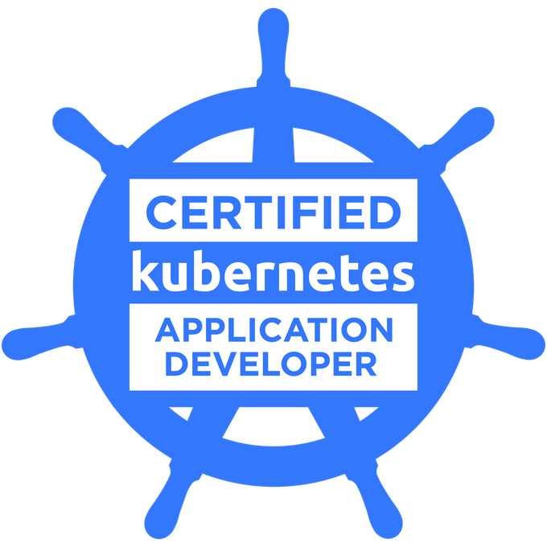
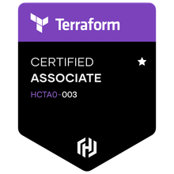

---
hide:
  - navigation
---

# Resume

## Profile

I'm a passionate DevOps engineer always looking for new ways to improve our productivity (1). I use strategic learning
to optimize my progression.
{ .annotate }

1. On the way to DevSecOps and Platform Engineering.
2. See (#drone-process-civilian-drone-pilot-and-instructor)

[//]: # (@formatter:off)
/// admonition |  I'm looking for a company where I will stay for a long time working for its wealthiness.
    type: tip
///
[//]: # (@formatter:on)

## Contact details

[//]: # (@formatter:off)

- :material-human-male:{ .lg .middle; style="margin-right: 25px" }  __LIORET__ Robin
- :material-phone:{ .lg .middle; style="margin-right: 25px" }  +33(0) 6 59 55 50 84
- :material-email:{ .lg .middle; style="margin-right: 25px" }  robin.lioret.epro@gmail.com
- :material-linkedin:{ .lg .middle; style="margin-right: 25px" }  [LinkedIn profile](https://www.linkedin.com/in/robin-lioret-1a278b89)
- :material-github:{ .lg .middle; style="margin-right: 25px" }  [GitHub profile](https://github.com/robinlioret)
- :simple-credly:{ .lg .middle; style="margin-right: 25px" }  [Credly profile](https://www.credly.com/users/robin-lioret.08e8ea51)

[//]: # (@formatter:on)

### Languages

[//]: # (@formatter:off)

- :flag_fr:{ .lg .middle; style="margin-right: 25px" }  French: native
- :flag_gb:{ .lg .middle; style="margin-right: 25px"}  English: fluent (TOEIC C1)

[//]: # (@formatter:on)

## Personal values

[//]: # (@formatter:off)

- :fontawesome-solid-graduation-cap:{ .lg .middle } __Learn everyday__

    ---

    Computer science is vast, an almost infinite ways to combine things. Learning is one, if not the most,
    important habit to have in this industry.

    I like to learn something new everyday through reading, videos, blogposts
    or talking to a coworker.

    [:octicons-arrow-right-24: Learning strategies and tactics](gists/learning.md)

- :material-share-variant:{ .lg .middle } __Share__

    ---

    A continuum of my learning process. As a former insructor, I always liked sharing my knowledge, seeing other people
    skills up grant me satisfaction. Altough, sharing knowledge between coworkers is the best way
    I know to efficiently improve the team's efficiency and reduce the overwhelming daily workload.

- :material-clock-fast:{ .lg .middle } __Take the time to be fast__

    ---

    Everyone knows than speed isn't precipitation. Although, it's often hard to observe this principle on the daily work.
    It's something important to me, especially since I realized than taking the time to do the things is more effective
    than running around in circle.

    [:octicons-arrow-right-24: A word about "temporary"](gists/temporary.md)

- :fontawesome-solid-sun:{ .lg .middle } __Keep things light__

    ---

    While working in the aeronautics, I learnt how to take things seriously while keeping the burden as light as possible.

    Counter-intuitively, this helps a lot when a critical situation happens: the brain works better in a lighter mood.

- :material-scale-balance:{ .lg .middle } __Team Work__

    ---
  
    Our line of work is often huge with many moving parts. One person can certainly not manage it all by themselves.
  
    Working with a team spirit is essential in our industry, it prevents a lot of unpleasant scenarios...

- :material-scale-balance:{ .lg .middle } __Communicate genuinely in goodwill__

    ---

    I like to express my thankfulness as well as my concerns a direct yet respectful way. However, if one may found my
    communication style too "direct", it's always made in goodwill with our shared interests in mind.

[//]: # (@formatter:on)

## Skill domains

<figure markdown="span">

 
<figcaption>There is more than shown in the above diagram !</figcaption>
[See skills](./skills/index.md){ .md-button }
[See portfolio](./portfolio/index.md){ .md-button }
</figure>

## Certifications

[//]: # (@formatter:off)

-   [{ style="height:100px"; align=left  }](https://www.credly.com/badges/98ebc4cc-d7aa-4807-93d6-f7977086041c/public_url)
    __AWS Certified Cloud Practitioner__
     [:octicons-arrow-right-24: See on Credly](https://www.credly.com/badges/98ebc4cc-d7aa-4807-93d6-f7977086041c/public_url)

-   [{ style="height:100px"; align=left  }](https://www.credly.com/badges/aee73c36-9980-4ce6-b8cd-110f287a0fb6/public_url)
    __Certified Kubernetes Administrator__
     _Kubestronaut program_
     [:octicons-arrow-right-24: See on Credly](https://www.credly.com/badges/aee73c36-9980-4ce6-b8cd-110f287a0fb6/public_url)

-   [{ style="height:100px"; align=left  }](https://www.credly.com/badges/26a90afc-48be-41d9-ae7f-122f0db79146/public_url)
    __Certified Kubernetes Application Developer__
     _Kubestronaut program_
     [:octicons-arrow-right-24: See on Credly](https://www.credly.com/badges/26a90afc-48be-41d9-ae7f-122f0db79146/public_url)

-   [{ style="height:100px"; align=left  }](https://www.credly.com/badges/a11fe645-e40f-4ff3-86c6-bfda4506451a/public_url)
    __Microsoft Certified: Azure Fundamentals__
     [:octicons-arrow-right-24: See on Credly](https://www.credly.com/badges/a11fe645-e40f-4ff3-86c6-bfda4506451a/public_url)

-   [{ style="height:100px"; align=left  }](https://www.credly.com/badges/ecd002fa-0eef-435f-a71b-069097cf7a42/public_url)
    __HashiCorp Certified: Terraform Associate__
     [:octicons-arrow-right-24: See on Credly](https://www.credly.com/badges/ecd002fa-0eef-435f-a71b-069097cf7a42/public_url)

[//]: # (@formatter:on)

### In progress certifications

[//]: # (@formatter:off)

{ .lg middle; style="height: 50px; margin-right: 20px; display: flex"; align=left }  __Certified Kubernetes Security Specialist__ _Kubestronaut program_
{ .card }

{ .lg middle; style="height: 50px; margin-right: 20px; display: flex"; align=left }  __Kubernetes and Cloud Native Associate__ _Kubestronaut program_
{ .card }

{ .lg middle; style="height: 50px; margin-right: 20px; display: flex"; align=left }  __Kubernetes and Cloud Security Associate__ _Kubestronaut program_
{ .card }

{ .lg middle; style="height: 50px; margin-right: 20px; display: flex"; align=left }  __AWS Architect Associate__
{ .card }

[//]: # (@formatter:on)

## Professional Experience

### Computer science experience

#### Capgemini

[//]: # (@formatter:off)
/// admonition | From November 2021 ongoing (Full time)
    type: tip
///
[//]: # (@formatter:on)

I first served as an Infrastructure Analyst where I progressed on Linux, networking, automation and cloud infrastructure
on AWS. Then, I switched to a DevOps engineer role on Kubernetes. I'm primarily in charge of:

- Stability and evolution
- Security and permissions
- Leading projects to [consolidate the pillars](gists/pillars.md)

My missions are diverse and rich, they go from the basic tasks of daily maintenance like managing storage, network
traffic, users, infrastructure provisioning, etc. To advanced and complex ones:

- Kubernetes administration
- Advanced AWS configurations: permissions, security, performance, etc
- Supply chain management (CI/CD pipelines, Git repositories, GitOps implementation)
- Documentation automatic generation
- And many more

[Take a look at my portfolio](./portfolio/index.md){ .md-button }

### Other meaningful experiences

#### PSDK (OpenSource community project)

[//]: # (@formatter:off)
/// admonition | From 2011 until 2021 (Part time)
    type: note
///
[//]: # (@formatter:on)

[PSDK](https://pokemonworkshop.com/fr/sdk) is an open source community-driven game engine and edition started in 2015
after the retirement of PSP. It provides all the tools required for the people to create their own game.

I was a developer for the project. My missions were to **identify the things that need improvement** and implement them
in Ruby. I also **took the lead on many complex projects** like implementing a Pathfinding algorithm, advanced player
interaction, etc.

[//]: # (@formatter:off)
/// admonition |
    type: abstract
It was unpaid work performed by passionate people on their free time. I'm grateful and honored for the opportunity
I had to learn among them !
///
[//]: # (@formatter:on)

#### Drone Process - Civilian drone pilot and instructor

[//]: # (@formatter:off)
/// admonition | From 2013 to 2017 (Part time)
    type: note
///
[//]: # (@formatter:on)

With a retired french air force pilot, we created our own company and onboarded on this new technology (it was new at
the time).

My missions were various: piloting the drones with high-tech camera to create photogrammetric models for the land
surveyor companies, or flying thermal imaging cameras above solar plants to collect data for the researchers, performing
artistic ballets for the opening of a large company campus (1)...
{ .annotate }

1. This was done with a pilot, before the ballets was made of hundreds of programmed drone.

This activity provided the fertile terrain to acquire a lot of transversal principles that I'm bringing in my daily work
today.
Among them:

- **Ensure fail-safe**: always have a rollback or backup plan in case of failure
- **Always prepare**: as we said back then, a well-prepared operation is a well-executed operation
- **Have eyes everywhere**: it helps to anticipate most of the unexpected incidents

This activity involves a lot of regulatory compliance and **rigorous processes and procedures to ensure security and
safety**.

After a year, we created the Drone Process Training school and I became an instructor. Then, I learnt numerous
**andragogical(1) strategies and tactics** to transfer my knowledge.
{ .annotate }

1. Pedagogy, but for the adult.

## Education

[//]: # (@formatter:off)

- :fontawesome-solid-graduation-cap:{ .lg .middle } __2011: Baccalaureate__

    ---
    
    At Lycée Monge (Chambéry), with mention.
    
    Engineering science with a mathematics speciality.

- :octicons-goal-16:{ .lg .middle } __2015: General purpose coaching formation__

    ---
    
    With ECF (Ecole de Coaching Francophone)
    
    Main skills: goal specification, strategic thinking, self-awareness, communication, etc.

[//]: # (@formatter:on)

## Hobbies

- Critical thinking
- Swiming, Climbing, Running, Cycling
- Programing, exploration, open source
- Fiction writing

